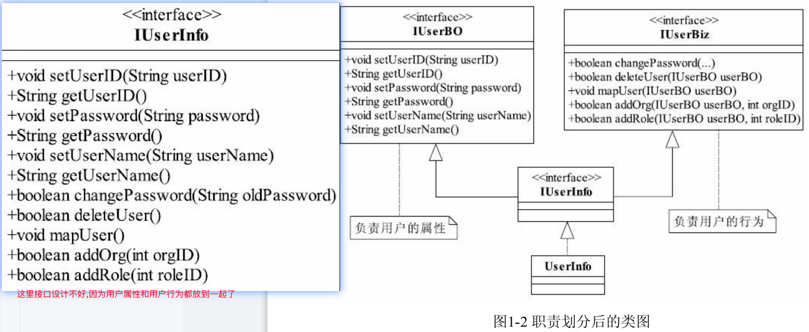
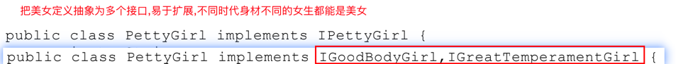

#六大设计原则

###单一职责

用户信息抽取一个BO(business object),用户行为抽取一个Biz(business logic,业务逻辑)

###里式替换原则
父类出现的地方,子类也可以出现---子类可以完全实现父类的功能---不能反过来

###依赖倒置原则
抽象不要依赖细节,细节应该依赖抽象,高层模块不应该依赖底层模块,两者都应该依赖抽象
###接口隔离原则
单一职责要求的是类和接口职责单一,注重的是职责,是业务逻辑上的划分,接口隔离要求方法尽量少

